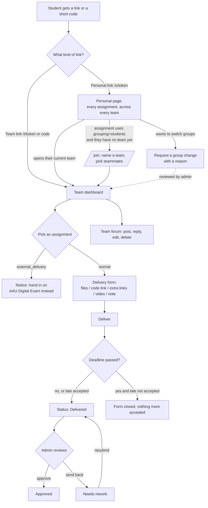
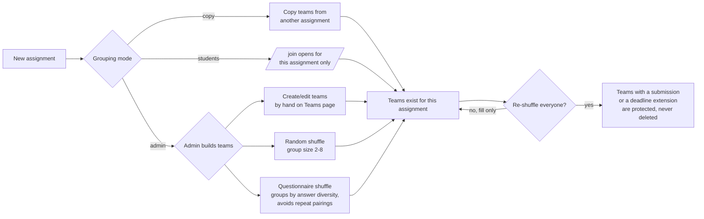
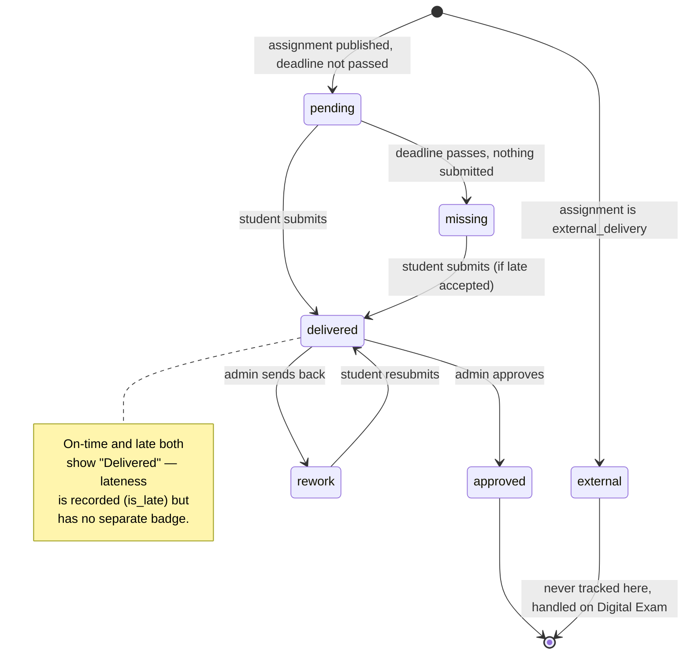
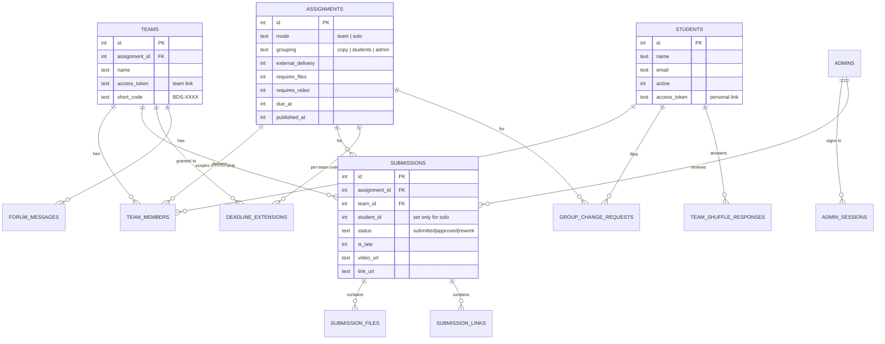
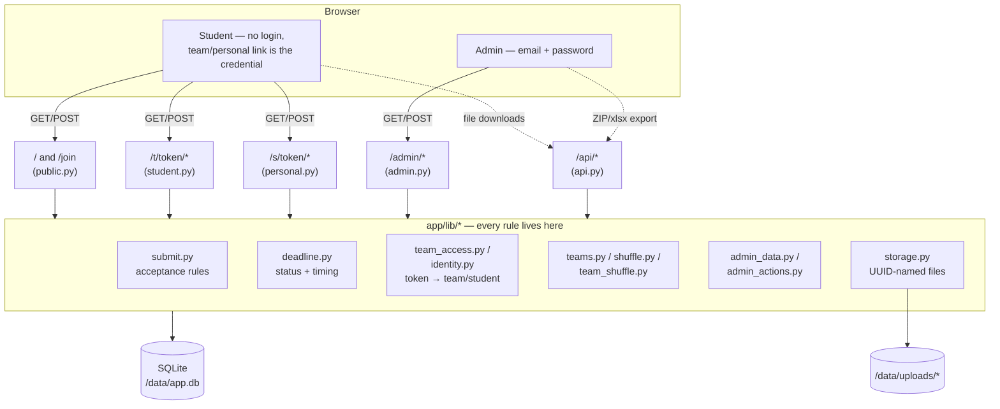

# BDS Assignment Portal


A self-hosted web app where students on the **Business Data Science** master's
at Aalborg University hand in their weekly assignments, and the course
responsible sees at a glance who has delivered, who is missing, and who needs
to be chased — without either side ever creating an account.

---

## Table of contents

- [The idea in one paragraph](#the-idea-in-one-paragraph)
- [Capabilities](#capabilities)
- [User flows](#user-flows)
- [Data model](#data-model)
- [Architecture](#architecture)
- [Tech stack](#tech-stack)
- [Route reference](#route-reference)
- [Development](#development)
- [Deployment](#deployment)
- [Security posture](#security-posture)
- [Known limitations](#known-limitations)
- [What could be built next](#what-could-be-built-next)

---

## The idea in one paragraph

Nobody logs in. A **team** is identified by a private link (`/t/<token>`) or a
short, typeable code (`BDS-7K2P`); a **student** additionally has their own
permanent personal link (`/s/<token>`) that lists every assignment they're in,
across every team they've ever been placed on. The class roster is imported
once by the admin, so every "who is this?" dropdown offers real people and
every delivery count adds up against a known denominator. The design
constraint behind all of it: **friction for students must be near zero** — no
account, no password, no verification email, nothing to remember except one
bookmarked URL.

The admin side is the opposite: a real password, a server-side session, and an
audit log — because that side holds every submission for the whole class.

---

## Capabilities

### Assignments

- **Team or solo** (`mode`). A solo assignment reuses the same team page, but
  expands into one row per member with its own independent delivery.
- **Requirements are toggles, not code**: requires files, requires video (at
  least one must be on, see the exception below), allowed file extensions,
  per-assignment max file size, whether late deliveries are still accepted
  after the deadline.
- **External delivery.** An assignment can be marked "delivered on AAU's
  Digital Exam site instead" — this turns off the upload form entirely, shows
  students a plain notice on their team page instead of a form, and excludes
  the assignment from the missing/outstanding counts everywhere in the admin
  panel, since it was never going to be delivered here.
- **Draft vs. published.** An assignment is invisible to every team — even one
  that already has the link — until *Published* is ticked. A half-written
  brief can never be exposed by a guessed URL.
- **Per-team deadline extensions**, layered on top of the assignment's own
  deadline without touching it for anyone else.

### Team formation — three admin-chosen modes per assignment

Each assignment picks one **grouping** strategy, set once when the assignment
is created:

| Grouping | Who places students | What it looks like |
|---|---|---|
| `copy` | Admin, by carrying over another assignment's teams | One click on the assignment page: "Copy teams from another assignment" |
| `students` | Students themselves | `/join` opens for that assignment only; a student names a team and picks teammates from whoever's still unassigned |
| `admin` | Admin, by hand or by an automated split | The Teams page: create teams one at a time, or run a shuffle |

On top of manual team-building, the admin has two **automated splitting**
tools, both available from the Teams page and both safe to re-run:

- **Random shuffle** — cuts a chosen group size (2–8) out of whoever has no
  team yet. "Re-shuffle everyone" additionally deletes and re-cuts every
  existing team for that assignment, except any team that already has a
  submission or a deadline extension attached — those are never touched,
  because deleting them would take real deliveries and their files down too.
- **Questionnaire-based shuffle** — a short, deliberately non-academic,
  personality-flavoured questionnaire ("if you were a pizza topping…") that
  students fill in once on their personal page. The splitter groups by answer
  diversity (each team's "mix %" is shown) and actively avoids re-pairing two
  students who already shared a team on any past assignment. Anyone who
  hasn't answered yet is skipped and left for the random shuffle to pick up.

Whichever method places a team, the admin can afterwards rename it, move
individual members between teams, add or remove a member, or **regenerate**
its link and code (invalidates the old one immediately — the fix for a leaked
link).

### Student self-service

- **`/join`** — pick a still-published assignment with `grouping = students`,
  name a team, tick teammates off the list of people not yet on a team for
  that assignment. A last-moment race (someone else claims a teammate first)
  is caught and reported rather than silently corrupting the team.
- **Group change requests** — a student can ask, from their personal page, to
  be moved to a different group for one assignment, with a reason. They don't
  pick a destination team (that stays the admin's call); the admin reviews
  the queue, picks where they land, and the move is recorded exactly like a
  manual move would be.
- **Identity cookie** — after visiting their personal link once, a student's
  browser is recognised on every team page they're a member of: no more
  picking their own name from a dropdown before delivering or posting to the
  forum.

### Delivery & review

- A delivery accepts a mix of **file uploads**, a **primary code link** (e.g.
  a Colab or GitHub URL — accepted as an alternative to a file, not only
  alongside one), any number of **extra links**, an optional **video link**
  with an explicit "I've set the sharing so AAU staff can watch it"
  confirmation, and a free-text **note** to the reviewer.
- **Replaceable until the deadline** (or forever, if the assignment accepts
  late deliveries) — resubmitting fully replaces the previous delivery and
  clears any prior review outcome, putting it back in the queue as fresh.
- **Review workflow**: an admin approves or sends a delivery back for rework
  with a comment, which is what the team sees on their own page. Feedback can
  also be emailed directly from the admin panel via a pre-filled `mailto:`
  link — nothing sends automatically.
- **Status is deliberately simple**: `pending → missing` (nothing in, before
  or after the deadline) or `pending → delivered → approved`/`rework`. Late
  delivery is still tracked as a fact (`is_late`, shown next to the submitted
  timestamp, counted separately in the admin summary and in the CSV export)
  but does **not** get its own status badge — a late delivery and an on-time
  one both simply read "Delivered".
- **Missing-only filter** on the delivery matrix, plus a one-click "chase by
  email" that opens a blank message to every member of a team that hasn't
  delivered.

### Collaboration

- Every team has a **private forum** on its own dashboard — one level of
  threading (replies to a root message, not to each other), post/edit/delete,
  and new messages appear for teammates without a page refresh (short-poll
  fragment).

### Admin operations

- **Delivery matrix** per assignment: every team/student, current status,
  submitted time, files (each a working download link), every link, video,
  note, and inline review + extension controls, filterable to outstanding
  only.
- **Notifications feed** — a running log of things worth an admin's
  attention (new/replaced delivery, forum post, team created, change request
  filed), with an unseen-count badge.
- **Audit log** — every consequential action (team created, submission
  replaced, change request approved, etc.) recorded with an actor name, an
  IP, and a detail string.
- **Roster management** — bulk-paste import that understands plain CSV,
  semicolon-CSV, `Name <email>` pairs, or bare email addresses; add, edit,
  deactivate, or remove a student one at a time; track whether that student's
  personal link has been sent yet.
- **Settings** — semester name, short course code (used in email subject
  lines), support email shown on every student page, default max upload
  size, and the team-shuffle questionnaire on/off switch.
- **Multiple admin accounts**, each with their own login and audit trail.

### Exports

- **Per-assignment ZIP + CSV + HTML index** — every submitted file, foldered
  by team, plus a `summary.csv` and a standalone `index.html` (open it
  straight from the unzipped folder for a clickable table). Both list every
  team member with their email in one column, and give every delivered link
  its own column rather than mashing them together.
- **Team formation as `.xlsx`** — one click on the Teams page downloads the
  current roster for that assignment: one row per student grouped by team
  (team name, team code, name, email), plus an "Unassigned" section for
  anyone not yet placed.

---

## User flows

### Student journey



### Team-formation decision (admin picks per assignment)



### Submission status



---

## Data model



`submissions.student_id` is `NULL` for a team delivery and set for a solo one
— a team assignment has exactly one live submission row, a solo assignment
has one per member. That null is the join key every read path (dashboard,
delivery matrix, ZIP export) uses to tell the two apart.

---

## Architecture



Two things worth calling out:

- **Every rule lives in `app/lib`, not in a route handler.** A route function
  is a thin wrapper: parse the request, call into `lib`, render or redirect.
  This is what lets, e.g., `create_change_request()` or `move_student()` be
  reused identically whether a human clicked a button or an approval flow
  called it internally.
- **One SQLite connection per process**, opened lazily and cached, with WAL
  and a write lock (`db_lock`) that serializes the handful of writers this
  app ever has. There is no ORM — every query is plain SQL against
  `sqlite3.Row` objects, kept intentionally simple for a database this size.

---

## Tech stack

| Layer | Choice | Why |
|---|---|---|
| Language / framework | Python 3.13, FastAPI | Small, explicit, no build step |
| Templates | Jinja2 | Server-rendered HTML, no client-side framework or bundler |
| Database | SQLite (stdlib `sqlite3`) | One file (`/data/app.db`); a backup is a directory copy |
| Migrations | Hand-written `.sql` files in `drizzle/`, applied at boot | No ORM migration tooling — plain SQL, tracked in a `schema_migrations` table |
| Passwords | `bcrypt` (cost 12) | Admin accounts only |
| Spreadsheets | `openpyxl` | Team-formation `.xlsx` export |
| Frontend | Vanilla CSS + a small hand-written `app.js` | Dark mode toggle, tabs, confirm dialogs, forum short-polling — no framework |
| Packaging | Docker (`python:3.13-slim`), one bind-mounted `/data` volume | Whole app is one container plus one directory |
| Hosting | Coolify (`automate.business.aau.dk`) | See [COOLIFY.md](./COOLIFY.md) |

**Why SQLite, no ORM, no frontend framework.** This is sized for one course —
a few dozen teams delivering once a week. Every dependency here is one that
earns its place on a phone-sized budget of operational complexity: the whole
app is a single Python process, a single file database, and a directory of
uploads. There is nothing to build, bundle, or compile before it runs.

---

## Route reference

**Public** — no credential at all.

| Route | Purpose |
|---|---|
| `GET /` | Landing: type a team's short code |
| `POST /` | Redirects a valid code to its team page |
| `GET /join` | List assignments open for self-service team formation, or the pick-your-teammates form for one |
| `POST /join` | Create a team |

**Student-facing** — a team link, short code, or personal link is the credential.

| Route | Purpose |
|---|---|
| `GET /t/{token}` | Team dashboard: members, team code, every published assignment's card |
| `GET /t/{token}/a/{id}` | One assignment's delivery form (or the Digital Exam notice, if external) |
| `POST /t/{token}/a/{id}` | Submit or replace a delivery |
| `GET/POST /t/{token}/forum/*` | Post, edit, delete, and live-poll the team forum |
| `GET /s/{token}` | Personal page: every assignment across every team this student is in |
| `POST /s/{token}/request-change` | File a group change request |
| `POST /s/{token}/team-shuffle` | Save the team-forming questionnaire |

**Admin** — email + password, server-side session.

| Route | Purpose |
|---|---|
| `GET/POST /admin/login`, `/admin/logout` | |
| `GET /admin` | This week at a glance |
| `GET /admin/notifications` | Event feed |
| `GET/POST /admin/assignments*` | Create, edit, delete, and the delivery matrix |
| `POST /admin/review`, `/admin/extension` | Approve/rework a delivery; extend one team's deadline |
| `GET/POST /admin/students*` | Roster: import, add, edit, deactivate, remove |
| `GET/POST /admin/change-requests*` | Review and resolve group change requests |
| `GET/POST /admin/teams*` | Create, rename, move members, shuffle, copy, regenerate links |
| `GET /admin/teams/export` | Download the team formation as `.xlsx` |
| `POST /admin/team-shuffle/*` | Toggle the questionnaire; form teams from its responses |
| `GET/POST /admin/settings*` | Semester settings, support email, admin accounts |

**API**

| Route | Purpose |
|---|---|
| `GET /api/health` | Touches the database; used as the container healthcheck |
| `GET /api/files/{stored_name}` | Serves one uploaded file to an admin, or a holder of the owning team's token |
| `GET /api/admin/assignments/{id}/download` | ZIP + `summary.csv` + `index.html` for one assignment |

---

## Development

```bash
python -m venv .venv
.venv/Scripts/activate           # .venv/bin/activate on macOS/Linux
pip install -r requirements.txt

# ADMIN_EMAIL / ADMIN_PASSWORD seed the first admin account on boot
ADMIN_EMAIL=admin@example.com ADMIN_PASSWORD=changeme \
  uvicorn app.main:app --reload --port 3000
```

Local data lives under `./.data` by default (`DATA_DIR` overrides it — see
[COOLIFY.md](./COOLIFY.md) for the port-collision gotcha between a container
and a locally running dev server). Migrations in `drizzle/*.sql` apply
themselves at startup, tracked in a `schema_migrations` table — there's no
separate migrate step to remember.

---

## Deployment

The production instance runs on Coolify at
`bds-assignment-portal.automate.business.aau.dk`; the operational playbook
(API tokens, deploy triggers, storage, gotchas specific to that instance) is
in [COOLIFY.md](./COOLIFY.md). General container/Tailscale/reverse-proxy
notes are in [DEPLOYMENT.md](./DEPLOYMENT.md).

The database and every uploaded file live in one bind-mounted directory,
entirely separate from the image — rebuilding replaces the application code
and never the data. A backup is a copy of that directory.

---

## Security posture

- **Students are not authenticated.** A team link and a personal link are
  each a long random token; holding one is the only thing that proves who
  you are. This is a deliberate trade for zero-friction delivery. The
  mitigations are the audit log and a one-click **regenerate** on a team
  whose link has leaked.
- Admin passwords are bcrypt (cost 12), checked against a dummy hash on an
  unknown email so login timing can't be used to enumerate accounts.
  Sessions are opaque random tokens in an `HttpOnly`, `SameSite=Lax` cookie.
- Uploaded files are stored under machine-generated names and served only to
  an admin or to a holder of the owning team's token, with
  `Cache-Control: private, no-store`.
- The app makes no outbound network requests of its own. Video and code
  links are stored as plain text and only ever rendered as a link for a
  human to click.

## Known limitations

- **Single instance only.** SQLite plus a local uploads directory means no
  horizontal scaling — this is sized for one course, not a faculty.
- A student is on exactly one team per assignment at a time; teams can be
  re-cut between assignments but not held simultaneously for two different
  ones.
- No email is sent by the app itself — every "chase" or "email feedback"
  action opens a pre-filled `mailto:` link for a human to actually send.
- An admin's password is set once, when the account is created, and cannot be
  changed from inside the app afterwards — only the sign-in email can. A
  forgotten password means deleting and recreating that admin account.

## What could be built next

Ideas that fit the app's existing shape without expanding its footprint:

- **Reminder emails** sent by the server itself (a background job hitting an
  SMTP relay) instead of every chase requiring a human to click "send" —
  the biggest gap between "the data exists" and "someone acted on it."
- **Per-student delivery history** on the personal page: a compact timeline
  of every assignment's outcome across the semester, not just this week's.
- **Bulk review actions** on the delivery matrix (approve everything that
  meets a rule, e.g. "on time and files present") for large cohorts where
  reviewing one row at a time is the bottleneck.
- **Configurable statuses** — right now `approved`/`rework` are fixed; a
  course with a different grading vocabulary (e.g. pass/fail/resubmit) would
  need this hardcoded pair to become admin-editable.
- **Exporting the delivery matrix itself** (not just team formation) to
  `.xlsx`, alongside the existing ZIP/CSV, now that the export path already
  exists for the team roster.
